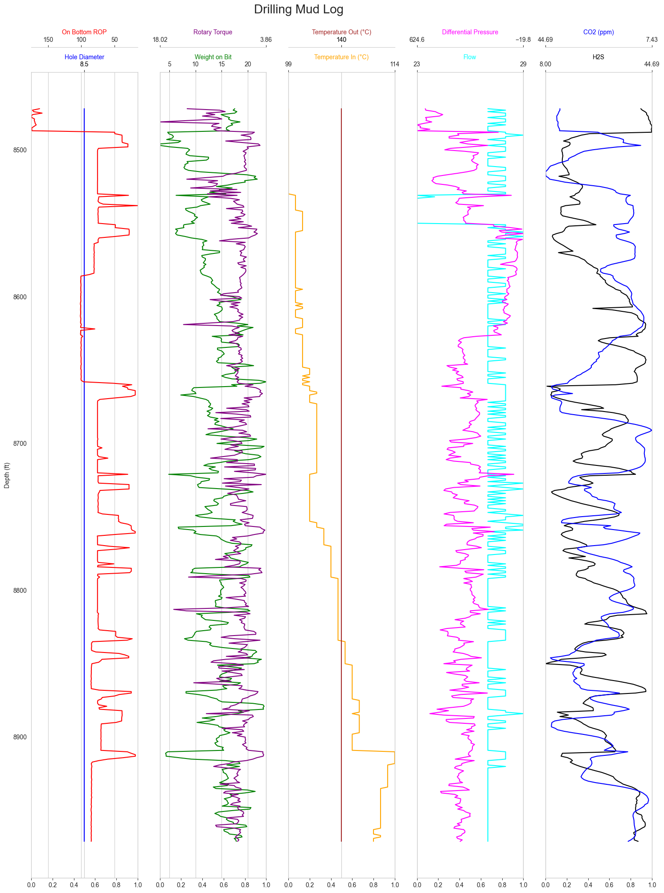
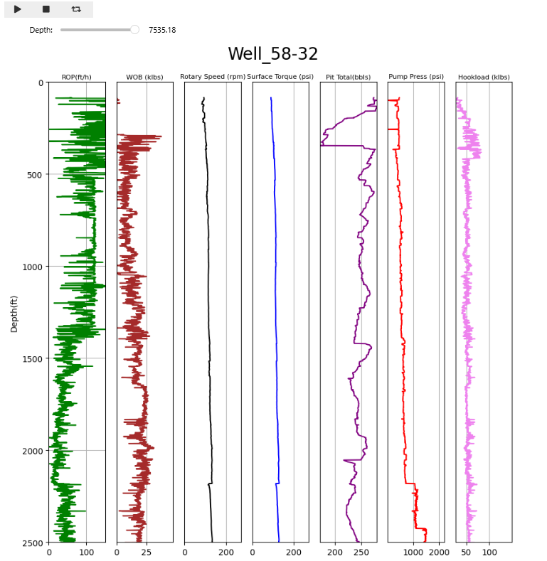

# Real Time Drilling Parameters Analytics & Visulization

## Overview

The **Real Time Drilling Parameters Analytics & Visulization** is a simple workflow for drilling engineers and data scientists working in upstream oil and gas. It delivers two complementary Jupyter notebooks that ingest raw drilling and mud-log measurements, perform data cleaning and outlier removal, and generate both static and interactive multi‐track visualizations. These workflows illuminate mechanical, hydraulic, and formation behaviors throughout the drilling process, enabling rapid diagnosis of performance issues and informed operational decisions.

## Repository Structure
 
```
project-root/
├── data/
│   ├── well58_32_parameters.csv      # Raw drilling parameters
│   └── mud_log_full.csv               # Raw mud-log dataset
├── notebooks/
│   ├── DrillingParametersPlot.ipynb   # Multi‑track drilling parameter analysis
│   └── DrillingMudLogs.ipynb          # Multi‑track mud-log visualization
└── README.md                          # Project documentation
```

## Prerequisites

* **Python 3.8+**
* **Jupyter Notebook** or **JupyterLab**
* Python libraries (see `requirements.txt`):

  * `pandas` for high-performance tabular processing
  * `numpy` for numerical operations
  * `matplotlib` for core plotting
  * `ipywidgets` for interactive controls
  * `seaborn` for enhanced statistical graphics

Install dependencies with:

```bash
pip install -r requirements.txt
```

## Data Description

1. **Well 58-32 Drilling Parameters** (`well58_32_parameters.csv`)

   * Time-indexed record of drilling metrics: weight-on-bit (WOB), rate-of-penetration (ROP), rotary torque, hookload, pump pressure, surface temperature, flow rates, and more.
   * Approximately 7,300 depth-aligned measurements spanning spud-in through total depth.

2. **Full Mud-Log Dataset** (`mud_log_full.csv`)

   * Real-time mud-log outputs: hole depth, on-bottom ROP, standpipe pressures, flow rates, mud tank volumes, multi-gas concentrations (CO₂, H₂S, methane), downhole temperature, motor torque, and additional MWD signals.
   * Contains sentinel values (`-999.25`) that denote missing data and require filtering.

## Notebook Summaries

### 1. DrillingParametersPlot.ipynb

* **Environment Setup**: Imports core libraries, reads the CSV into a `pandas` DataFrame, and verifies data integrity via descriptive statistics and column listings.
* **Data Cleaning**: Filters out shallow intervals (<700 ft), removes ROP outliers (>150 ft/hr), and constructs a focused DataFrame for plotting.
* **Static Visualizations**: Generates classic ROP vs. depth curves and four‑track parameter logs (ROP, WOB, torque, rotary speed) in a specified depth window.
* **Interactive Engine**: Defines functions (`plotting` and `log_plot1`) that render animated multi-track logs up to a given depth using `ipywidgets.Play` and `FloatSlider`, culminating in a seven‑track log that adds temperature, pump pressure, pit volume, and hookload.

### 2. DrillingMudLogs.ipynb

* **Initial Inspection**: Loads the comprehensive mud-log CSV, enumerates all columns, and extracts a curated subset of 25 critical parameters.
* **Preliminary Plot**: Produces a single-track on-bottom ROP vs. hole depth plot to validate axis orientation and data indices.
* **Multi-Track Visualization**: Implements `plot_mudlog(data)` to render five synchronized tracks:

  1. Hole diameter & ROP (dual x-axes)
  2. WOB & rotary torque
  3. In-flow vs. out-flow temperatures
  4. Flow rate & differential pressure
  5. H₂S & CO₂ concentrations
* **Missing Data Handling**: Replaces sentinel `-999.25` values with zeros to maintain continuous curves.
* **Focused Window**: Demonstrates the final five‑track mud-log over a targeted 500-row slice for clear operational insights.

## Usage Instructions

1. **Launch** a notebook server:

   ```bash
   jupyter lab    # or: jupyter notebook
   ```
2. **Open** either notebook under `notebooks/`.
3. **Execute** cells sequentially. Markdown narrative cells precede each code block, providing context and interpretation.
4. **Interact** with sliders and play controls to animate drilling progression and inspect parameter correlations dynamically.

## Extension and Customization

* **Additional Parameters**: Modify the curated column lists in each notebook to include or exclude signals (e.g., toolface, vibration indicators, downhole pressure).
* **Alternate Depth Windows**: Adjust slice indices or depth thresholds to focus on other intervals of interest (e.g., reservoir sections, high-pressure zones).
* **Exporting Outputs**: Integrate annotations or export figures via `matplotlib`’s `savefig` to generate publication-quality PDFs or PNGs.

## License

This project is released under the MIT License. See `LICENSE` for details.

---

By following this documentation, drilling engineers and data scientists can immediately leverage the notebooks to transform raw field measurements into actionable, high‐resolution visual narratives of downhole operations.
